# Lean4 项目实战

[前文](../tutorial/elan-lake.md)介绍了 Lean 项目的基本结构和文件组织方式，也介绍了 Lean 开发的三件套工具：elan、lake 和 lean。这些工具组合类似于其他语言生态中的工具链，比如：

- Rust 中的 rustup + cargo + rustc
- Node.js 中的 nvm + npm + node


本文将进行实战演练，完整体验 Lean 项目的开发流程，包括：

- 项目创建
- 依赖管理与配置
- 终端交互和元编程策略编写
- 测试，自动化以及收录相关

相关代码可以在仓库找到：[Lean-zh/MyTactics](https://github.com/Lean-zh/MyTactics)。

**参考资源**

- 元编程示例教程：[MetaExamples](https://github.com/siddhartha-gadgil/MetaExamples)
- Lean 中文文档：[函数式编程](https://www.leanprover.cn/fp-lean-zh/)，[Lake 文档](../references/lake-doc.md)以及 [Lean4 安装指南](../install.md)

**准备工作**

在开始之前，请确保：

1. 已正确安装 Lean4 开发环境，可以在命令行中运行 `elan`、`lake` 和 `lean` 命令
2. 了解 Lean 项目的基本结构，熟悉 `lakefile.lean` 和 `lakefile.toml` 等配置文件的作用

## 创建项目

首先创建一个新的 Lean 项目，命名为 `MyTactics`，并使用 Mathlib 作为依赖库。创建命令如下：

```bash
lake new MyTactics math.lean
```

执行完成后，将生成如下项目结构：

```bash
MyTactics/
├── MyTactics/
│   └── Basic.lean    # 基础模块文件
├── MyTactics.lean    # 主模块文件
├── README.md         # 项目说明文档
├── lakefile.lean     # Lake 构建配置文件
└── lean-toolchain    # Lean 工具链版本配置
```

### 创建的其他选项

Lake 提供了多种项目创建选项：

```bash
# 使用 TOML 格式的依赖配置文件
lake new MyTactics math.toml

# 创建不依赖 Mathlib 的纯 Lean 项目
lake new MyTactics .lean

# 使用指定版本的 Lean 创建项目
elan run leanprover/lean4:v4.10.0 lake new MyTactics .lean
```

特别注意，当使用 Mathlib 作为依赖时，新建项目会自动使用最新的 Lean 版本，这个行为与执行创建命令时的 Lake 版本无关。需手动修改 `lean-toolchain` 文件中的版本号。

## Lake 项目配置详解

### 基础配置文件

生成的 `lakefile.lean` 包含以下主要配置：

```lean
import Lake
open Lake DSL

package "MyTactics" where
  -- Settings applied to both builds and interactive editing
  leanOptions := #[
    ⟨`pp.unicode.fun, true⟩ -- pretty-prints `fun a ↦ b`
  ]
  -- add any additional package configuration options here

require "leanprover-community" / "mathlib"

@[default_target]
lean_lib «MyTactics» where
  -- add any library configuration options here
```

配置文件分为三个主要部分：

1. **包信息设置**（package）：
   ```lean
   package "MyTactics" where
     leanOptions := #[
       ⟨`pp.unicode.fun, true⟩
     ]
   ```

2. **依赖项声明**（require）：
   ```lean
   require "leanprover-community" / "mathlib"
   ```

3. **构建目标设置**（lean_lib）：
   ```lean
   @[default_target]
   lean_lib «MyTactics» where
   ```
   `@[default_target]` 表示这是默认构建目标，使用 `lake build` 时会自动构建。

#### 添加模块

每个 `lean_lib` 声明都需要对应实际的 Lean 文件，比如添加

```lean
lean_lib «Hello» where
```

则需在项目目录下添加 `Hello.lean` 文件。此外，可以用文件夹组织项目代码，例如 `Hello/greet.lean` 文件通过 `import Hello.greet` 导入。

#### 修改版本

如果引用了 Mathlib，建议使用以下配置，确保 Mathlib 版本与项目一致，避免构建错误。

```lean
require mathlib from git
  "https://github.com/leanprover-community/mathlib4.git" @ s!"v{Lean.versionString}"
```

这里 `s!"v{Lean.versionString}"` 会读取仓库当前的 Lean 版本。

### 配置可执行程序

在 Lean 生态中，很多项目都会提供可执行程序，例如：

- `lake exe cache get`：用于拉取 Mathlib 的构建缓存
- `lake env jixia`：运行 [JiXia](https://github.com/frenzymath/jixia) 的数据分析工具
- `lake env repl`：启动 Lean 的 REPL 环境

这些可执行命令通过 `lakefile.lean` 中的 `lean_exe` 参数进行配置。让我们在项目中添加两个可执行程序的配置：

```lean
lean_exe "hello" where
  root := `Hello.Greet

@[default_target]
lean_exe "demo" where
  root := `Demo
```

同样地，被 `@[default_target]` 标记的目标会在执行 `lake build` 时自动构建，无需显式执行 `lake build demo`。

除了 `lean_exe` 模块外，也可以用 `script` 字段定义脚本。例如：

```lean
script "greet" (args) do
  if h : 0 < args.length then
    IO.println s!"Hello, {args[0]'h}!"
  else
    IO.println "Hello, world!"
  return 0
```

运行 `lake script greet` 命令运行该脚本。

### 完整配置文件

到这里，我们初始化了一个 Lean 项目，并根据需求修改了依赖。完整的 `lakefile.lean` 内容如下：

```lean
import Lake
open Lake DSL

package "MyTactics" where
  -- Settings applied to both builds and interactive editing
  leanOptions := #[
    ⟨`pp.unicode.fun, true⟩ -- pretty-prints `fun a ↦ b`
  ]
  -- add any additional package configuration options here

require mathlib from git
  "https://github.com/leanprover-community/mathlib4.git" @ s!"v{Lean.versionString}"

@[default_target]
lean_lib «MyTactics» where
  -- add any library configuration options here

lean_lib «Hello» where

lean_exe "hello" where
  root := `Hello.Greet

@[default_target]
lean_exe "demo" where
  root := `Demo
```

配置完成后的项目结构：

```bash
MyTactics/
├── Demo.lean           # 演示程序主文件
├── Hello/
│   └── Greet.lean     # Hello 程序实现
├── Hello.lean         # Hello 模块主文件
├── MyTactics/
│   └── Basic.lean     # 基础功能实现
├── MyTactics.lean     # 主模块文件
├── README.md          # 项目文档
├── lake-manifest.json # Lake 依赖清单
├── lakefile.lean      # Lake 配置文件
└── lean-toolchain     # Lean 版本配置
```

添加了自定义的 `Hello/Greet.lean` 文件和 `Demo.lean` 文件。


接下来我们将开始编写具体的实现代码。

## 项目代码实现

在完成项目配置后，我们开始编写具体的代码实现。本节将分三个部分展示：

1. Hello World 程序
2. 交互式程序
3. 元编程策略

### Hello World 程序实现

作为程序员的传统，先从最基础的 Hello World 程序开始。

编写 `Hello/Greet.lean` 文件：

```lean
def name : String := "Rex"
def main : IO Unit := IO.println s!"Hello, {name}!"
```

然后在 `Hello.lean` 中导入模块：

```lean
import Hello.Greet
```

可以通过以下几种方式运行程序：

1. `lake exe hello`：重新构建并运行
2. `lake env hello`：直接运行已构建的程序
3. `lean --run Hello/Greet.lean`：直接执行脚本的 `main` 函数

下图展示了 `lake exe` 和 `lake env` 的区别：



> 💡 **关于 Lean 中的副作用**
> 
> Lean 的计算模型基于表达式求值，理论上是纯函数式的，不存在副作用（side effects）。
> 但现实中程序需要与外部世界交互，Lean 通过 `IO` 类型优雅地解决了这个问题：
> 
> - `main` 函数的类型 `IO Unit` 表明它不是一个直接产生副作用的函数
> - 而是一个描述了 IO 操作的声明性表达
> - 可以将 IO 操作视为一个接收"整个世界"作为输入，并返回新的世界状态的纯函数
>
> 更多关于 Lean 函数式编程的讨论，可以参考 [Lean 函数式编程指南](https://www.leanprover.cn/fp-lean-zh/hello-world/running-a-program.html)。


### 交互式程序

下边演示 Lean 如何处理用户输入。

创建 `Demo.lean` 文件，实现一个多行文本的拼接程序：

```lean
/-- 递归读取用户输入，直到遇到空行为止 -/
partial def getLines : IO String := do
  IO.print "Enter your text: "
  let line ← (← IO.getStdin).getLine
  if line.trim.isEmpty then
    return line.trimRight
  else
    return line.trimRight ++ (← getLines)

/-- 主程序：读取并拼接多行输入 -/
def main : IO Unit := do
  let stdin ← getLines
  IO.println s!"Concatenated lines: {stdin}"
```

这里 `partial` 关键字用于声明递归函数 `getLines`，告诉 Lean 编译器不需要验证函数的终止性。执行效果：


Lean 社区的 [REPL](../tool/repl.md) 就是基于类似的机制实现 Lean 与外部环境的信息交流。

### 编写元策略

在自定义元策略之前，先了解两个常用的 tactic：

1. `repeat`：重复执行某个策略直到证明完成
2. `first | tac₁ | tac₂ | ...`：按顺序依此尝试策略，任一成功即停止，否则报错

通过一道证明题来说明这些策略的用法：

```lean
-- 逐步证明 2 ≤ 6
example : 2 ≤ 6 := by
  apply Nat.le_step -- 2 ≤ 5
  apply Nat.le_step -- 2 ≤ 4
  apply Nat.le_step -- 2 ≤ 3
  apply Nat.le_step -- 2 ≤ 2
  apply Nat.le_refl -- 完成证明

-- ❌ 单独使用 repeat 无法完成证明
example : 2 ≤ 6 := by
  repeat (apply Nat.le_step)

-- ✅ 组合使用 repeat 和 first 完成证明
example : 2 ≤ 6 := by
  repeat (first | apply Nat.le_refl | apply Nat.le_step)
```

`repeat` 这一长串显然不太优雅，为了简化类似的证明过程，我们定义一个元策略：

```lean
/-- 
重复应用两个策略直到证明完成
参数：
- t₁: 第一个要应用的定理
- t₂: 第二个要应用的定理
-/
macro "repeat_apply" t₁:term "or" t₂:term : tactic => 
  `(tactic | repeat (first | apply $t₁ | apply $t₂))
```

将内容写入 `MyTactics/Basic.lean` 文件，并在 `MyTactics.lean` 中导入：

```lean
import MyTactics.Basic
```

之后通过 `import MyTactics` 即可在其他文件中使用该策略。

**使用示例**

现在，前边的例子可以这样写：

```lean
example : 2 ≤ 6 := by
  repeat_apply Nat.le_refl or Nat.le_step
```

或者用于证明其他类似式子：

```lean 
example : 30 < 39 := by
  repeat_apply Nat.le_refl or Nat.le_step

example : 30 < 40 := by
  repeat_apply Nat.succ_le_succ or Nat.zero_le
```

### 小结

我们演示了三个例子：

1. Hello World 程序：`Hello/Greet.lean`
2. 如何处理用户输入：`Demo.lean`
3. 元策略示例：`MyTactics/Basic.lean`


## 测试，自动化及发布

### 测试配置

最基本的测试配置是在 `lakefile.lean` 中使用 `@[test_driver]` 标记测试模块。

比如标记 `lean_exe` 模块：

```lean
@[test_driver]
lean_exe test {
  root := `Tests.Main
}
```

然后在 `Tests/Main.lean` 中实现测试逻辑：

```lean
def main : IO Unit := do
  -- 测试用例实现
  IO.println "Running tests..."
  -- 测试代码
```

使用 `lake test` 命令运行所有标记为测试的模块。

此外，也可以直接编写 shell 脚本，REPL 项目就是这么做的。当然，也有用于 Lean 测试的项目 [LSpec](https://github.com/argumentcomputer/LSpec)，后续再进一步探索。

### 自动化

自动化方面，这里贴一个 GitHub Workflow 供参考。当向 `main` 分支提交 PR 或者推送代码时触发。

```yaml
name: Run Tests

on:
  push:
    branches:
      - main
  pull_request:
    branches:
      - main

jobs:
  test:
    runs-on: ubuntu-latest
    steps:
    - name: Checkout code
      uses: actions/checkout@v2

    - name: install elan
      run: |
        set -o pipefail
        curl -sSfL https://github.com/leanprover/elan/releases/download/v4.0.0/elan-x86_64-unknown-linux-gnu.tar.gz | tar xz
        ./elan-init -y --default-toolchain none
        echo "$HOME/.elan/bin" >> $GITHUB_PATH

    - name: build
      run: lake build

    - name: Run tests
      run: lake test
```


### 项目发布

目前 Lean 生态系统还没有类似 Python 的 PyPI 这样的包注册表，无法通过类似 `pip install` 的方式直接安装包。Lean 项目主要通过 GitHub 托管和分发，使用 git 方式拉取依赖。

但是社区有个 [Reservoir 网站](https://reservoir.lean-lang.org/) 作为包索引平台，提供包的集中展示、构建测试和兼容性验证。收录项目需满足：

1. 公开的原创 GitHub 仓库（不接受 fork 或模板生成）
2. 根目录包含 `lake-manifest.json` 文件
3. 使用 OSI 认证的开源许可证
4. GitHub 仓库至少获得 2 个星标

如果项目满足这些条件，可以通过在 Reservoir 仓库提交 issue 申请收录，增加项目在社区的曝光度。

以上，欢迎讨论交流～