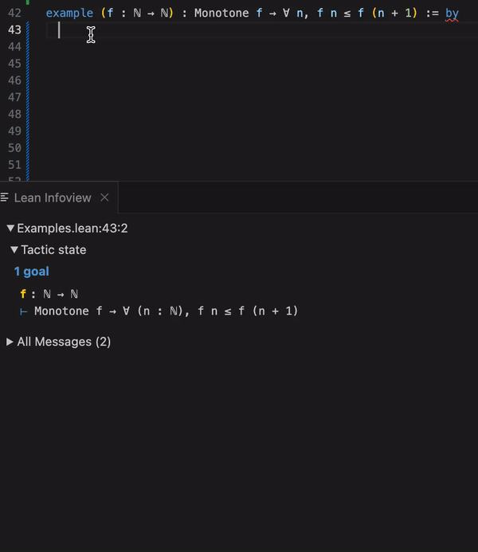

# Polyrith 策略

交互方面，除了外部与 Lean 交互，也可以让 Lean 与外部交互。Polyrith 策略是一个很好的例子，将 Lean 与外部计算引擎（SageMath）结合使用。

## 基本流程

Polyrith 的工作流程可以分为以下几步：
1. 将 Lean 的多项式表达式解析成 SageMath 可理解的形式
2. 调用 SageMath API 计算所需的系数
3. 将结果转换回 Lean 表达式
4. 使用 `linear_combination` 策略验证结果

## 基本原理

### SageMath 交互

Polyrith 通过 Python 脚本 `scripts/polyrith_sage.py` 与 SageMath API 交互。核心实现包括：

```lean
def sageOutput (args : Array String) : IO SageResult := do
  let path := (← getMathlibDir) / "scripts" / "polyrith_sage.py"
  unless ← path.pathExists do 
    throw <| IO.userError "could not find python script scripts/polyrith_sage.py"
  let out ← IO.Process.output { 
    cmd := "python3", 
    args := #[path.toString] ++ args 
  }
  // 处理输出和错误...
```

### Python 脚本功能

Python 脚本负责格式化数据，调用 Sage Web API，处理计算结果，并将结果转换回 Lean 可以解析的格式。

```python
def create_query(type: str, n_vars: int, eq_list, target):
    pass

def evaluate_in_sage(query: str):
    pass

def main():
    command = create_query(sys.argv[2], int(sys.argv[3]), sys.argv[4], sys.argv[5])
    final_query = polynomial_formatting_functions + "\n" + command
    if sys.argv[1] == 'true': # trace dry run enabled
        output = dict(success=True, trace=command)
    else:
        try:
            output = dict(success=True, data=evaluate_in_sage(final_query))
        except EvaluationError as e:
            output = dict(success=False, name=e.ename, value=e.evalue)
    print(json.dumps(output))
```

### Linear Combination

- `linear_combination` 策略允许用户为每个假设指定系数
- 如果目标多项式可以写成假设的线性组合，策略就会成功
- linear_combination 本质上是一个证书检查器

## 使用示例

```lean
example (x y : ℚ) (h1 : x*y + 2*x = 1) (h2 : x = y) :
    x*y = -2*y + 1 := by
  polyrith
-- Try this: linear_combination h1 - 2 * h2

example (x y z w : ℚ) (hzw : z = w) : 
    x*z + 2*y*z = x*w + 2*y*w := by
  polyrith
-- Try this: linear_combination (2 * y + x) * hzw
```

其他 Lean 项目，比如 llm step 也是类似的交互思路。

